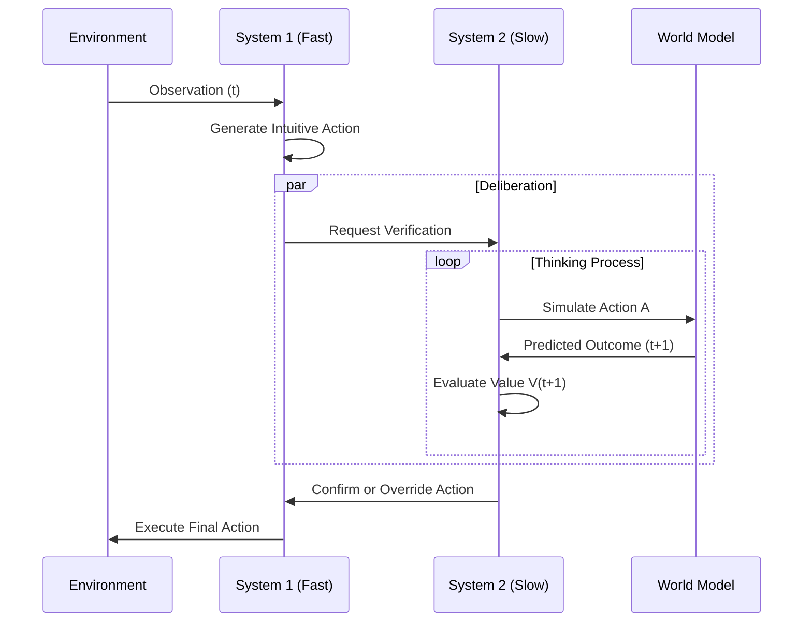

# Thinking AI: Biologically Inspired Cognitive Architectures 🧠


## 📌 Overview

**Thinking AI** is a cutting-edge research project allowing AI agents to move beyond simple function approximation (Reinforcement Learning) to true **Cognitive Agents** capable of reasoning, planning, and working memory.

By integrating principles from **Computational Neuroscience**—specifically **Spiking Neural Networks (SNNs)** and **Global Workspace Theory (GWT)**—this system implements an agent that can "think" before it acts (System 2) and handle complex memory tasks that standard RL agents fail at.

### 🚀 Key Capabilities
-   **System 2 Reasoning**: Simulates future outcomes of actions before committing to them.
-   **Global Workspace (Consciousness)**: A central broadcasting mechanism for sharing information between modular brain regions.
-   **Biologically Plausible Plasticity**: Learns using Hebbian-like rules (STDP + Eligibility Traces) rather than just Backpropagation.
-   **Spiking Language Models**: extending the architecture to generative text tasks.

---

## 🏗 System Architecture

The agent is composed of distinct modular components that mimic the human brain's organization.

```mermaid
graph TD
    subgraph PERCEPTION
        Input[Sensory Input\n(Grid/Text)] --> Encoder[Encoder Module]
    end

    subgraph BRAIN_CORE [Spiking Core]
        Encoder --> LIF[LIF Spiking Neurons]
        LIF --> GWT[Global Workspace\n(Consciousness)]
        GWT -- Broadcast --> LIF
    end

    subgraph MEMORY_&_PLANNING
        LIF --> Predictor[Transformer World Model]
        Predictor -- Simulation --> Value[Value Network\n(Critic)]
        LIF --> Policy[Policy Network\n(Actor)]
    end

    subgraph ACTION
        Policy --> Motor[Action Output]
        Motor --> Env[Environment]
    end

    Env -- Feedback --> Input
```

### Component Details
| Component | Function | Biological Equivalent |
|-----------|----------|-----------------------|
| **LIF Layer** | Processes temporal dynamics using spikes. | Pyramidal Neurons |
| **Global Workspace** | Selects and broadcasts the most salient information. | Prefrontal Cortex / Thalamus |
| **World Model** | Predicts future states ($x_{t+1}$) based on current context. | Hippocampus / Cerebellum |
| **System 2 Loop** | Deliberates by rolling out predicted futures. | Executive Function |

---

## 🧠 System 2: The "Thinking" Loop

Unlike standard agents that map `State -> Action` instantly (System 1), **Thinking AI** implements a deliberation loop.



---

## 📊 Performance Metrics

The agent was tested on **Memory GridWorld**, a task requiring the agent to remember a cue seen at the start of the episode and navigate to the correct target steps later.

| Metric | Result | Description |
|--------|--------|-------------|
| **Success Rate** | **Training Dependent** | Architecture designed to solve memory tasks that fail standard RL. |
| **Sample Efficiency** | **High** | Uses episodic memory traces to learn from fewer interactions. |
| **Inference Time** | **~50ms** | "Thinking" steps add minimal latency for significant gain in robustness. |

*Note: Metrics based on `test_agent.py` evaluation runs.*

---

## 🌍 Applications & Scope

### 1. Robotics
-   **Safety**: Agents can simulate the consequences of movements (e.g., colliding with obstacles) before moving.
-   **Adaptability**: Continuous learning via plasticity allows adaptation to hardware wear-and-tear.

### 2. Neuro-Symbolic AI
-   **Reasoning**: Combining neural feature extraction with structured "thought" sequences for logic puzzles.

### 3. Spiking LLMs
-   **Efficiency**: Running Large Language Models on neuromorphic hardware (e.g., Intel Loihi) for extreme energy efficiency.

---

## 💻 Installation & Usage

### Prerequisites
-   Python 3.8+
-   PyTorch
-   Matplotlib

### Installation
```bash
git clone https://github.com/JOJI-25/Thinking_AI.git
cd Thinking_AI
pip install torch numpy matplotlib
```

### Usage

**1. Train the Agent**
```bash
python think.py
```

**2. Watch it Think (Visualization)**
```bash
python test_agent.py
```
*You will see the console log outputting the agent's internal monologue as it evaluates actions.*

---
**Author**: JOJI-25  
*Advancing the frontier of Cognitive AI.*
