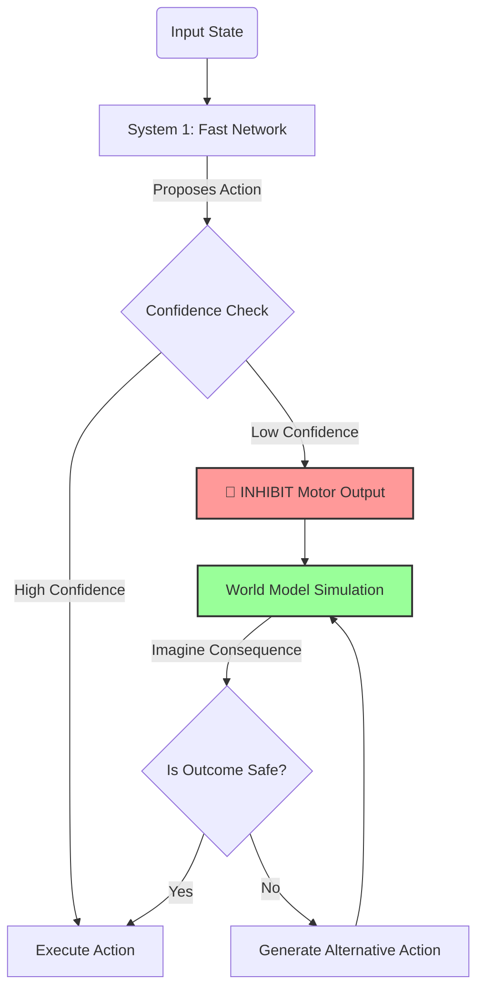

# 🧠 Thinking_AI: Biologically Inspired Cognitive Architecture


**Thinking_AI** is a research framework implementing a "Cognitive Agent" based on principles from Computational Neuroscience. It moves beyond standard Deep Reinforcement Learning (DRL) by incorporating **Spiking Neural Networks (SNNs)**, **Neuromodulated Plasticity**, and a **"System 2" Deliberation Loop**.

The goal is to create an agent that doesn't just *react* to its environment (System 1) but *perceives, attends, remembers, and deliberates* (System 2).

---

## 🏗 System Architecture & Diagrams

The architecture mimics the functional layout of a biological brain, utilizing a **Global Workspace** to broadcast information between sensory modules, working memory, and the motor cortex.

### 1. The BioAgent Architecture
This diagram shows how data flows from sensors into the Spiking Neural Network (SNN), competes for access to the Global Workspace (Consciousness), and informs the World Model.

```mermaid
graph TD
    subgraph Environment
    S[Sensory Input] -->|Spike Encoding| V1[Visual Cortex / SNN]
    end

    subgraph BioAgent Brain
    V1 -->|Feedforward| GW[Global Workspace<br>(Consciousness)]
    
    GW -->|Broadcast| WM[World Model<br>(Predictor)]
    WM -->|Imagined State| GW
    
    GW -->|Broadcast| BG[Basal Ganglia<br>(Action Selection)]
    
    BG -->|Inhibition signal| M[Motor Cortex]
    end
    
    M -->|Action| Environment
    
    style GW fill:#f9f,stroke:#333,stroke-width:2px
    style WM fill:#bbf,stroke:#333,stroke-width:2px
```

### 2. The "Thinking" Algorithm (System 2 Loop)
The core innovation is the ability to **inhibit** action and **simulate** the future. This flowchart describes the logic inside `agent.py`.



---

## ⚙️ How it Works: The Algorithm

The system operates in continuous time steps ($dt$) using three main biological principles:

### 1. Spiking Dynamics (`neuron.py`)
Instead of floating-point activations (e.g., `0.75`), neurons communicate via binary spikes (`0` or `1`). We use the **Leaky Integrate-and-Fire (LIF)** model:
$$\tau \frac{dV}{dt} = -(V(t) - V_{rest}) + R \cdot I(t)$$
* **V(t):** Membrane potential.
* **Firing:** When $V(t) > V_{threshold}$, the neuron spikes and resets. This inherently captures **temporal latency** in processing.

### 2. Synaptic Plasticity (`plasticity.py`)
We do **not** use Backpropagation (which is biologically implausible). Instead, we use a **Three-Factor Hebbian Rule**:
$$\Delta w_{ij} = \eta \cdot (\text{Pre} \times \text{Post}) \cdot \text{Dopamine}$$
* **Pre/Post:** The correlation between input and output spikes (Eligibility Trace).
* **Dopamine:** A global Reward or TD-Error signal that modulates the update. This allows the agent to learn **online** while exploring.

### 3. Deliberation (`agent.py`)
The agent maintains a **World Model** (Transformer-based). Before acting:
1.  It generates a candidate action.
2.  It queries the World Model: *"If I do this, what happens next?"*
3.  If the predicted state leads to a negative value (pain/penalty), the action is suppressed, and the agent "thinks" of a new plan.

---

## 📂 File Structure

| File | Role | Description |
| :--- | :--- | :--- |
| `agent.py` | **The Brain** | Integrates SNN, Workspace, and System 2 logic. |
| `neuron.py` | **Cells** | Defines LIF neurons and spike generation math. |
| `plasticity.py` | **Learning** | Implements Hebbian learning and Eligibility Traces. |
| `workspace.py` | **Memory** | The Global Workspace (Working Memory) implementation. |
| `modules.py` | **Prediction** | Contains the Transformer-based World Model. |
| `think.py` | **Training** | Main loop for GridWorld reinforcement learning. |
| `train_generative.py` | **LLM** | Script to train the system for text generation. |
| `config.py` | **Settings** | Hyperparameters (Learning rates, Time steps, Network size). |

---

## 🚀 Installation & Usage

### 1. Setup
```bash
git clone [https://github.com/JOJI-25/Thinking_AI.git](https://github.com/JOJI-25/Thinking_AI.git)
cd Thinking_AI
pip install torch numpy matplotlib gymnasium
```

### 2. Train the Cognitive Agent
Train the agent on a navigation task. It will learn to navigate a grid using spike-timing-dependent plasticity.
```bash
python think.py
```

### 3. Watch the Agent "Think"
Run the visualization script. The console will indicate when the agent enters the "Thinking..." state (System 2), pausing to simulate futures before moving.
```bash
python test_agent.py
```

---

## 🔮 Future Roadmap

* [ ] **Hippocampal Replay:** Implement "dreaming" to consolidate memories during idle times.
* [ ] **Visual Cortex:** Replace simple grid inputs with a Spiking CNN for pixel-based input.
* [ ] **Meta-Cognition:** Allow the agent to learn *when* to think, minimizing energy cost.

---

## 📜 License

Distributed under the MIT License.
