# 🧠 Thinking_AI: Biologically Inspired Cognitive Architecture


**Thinking_AI** is a research framework implementing a "Cognitive Agent" based on principles from Computational Neuroscience. It bridges the gap between biological intelligence and artificial intelligence.

Unlike standard Deep Reinforcement Learning (DRL) models (like DQN or PPO) which are often static "Function Approximators," this system implements **dynamic, biologically plausible mechanisms**:
1.  **Spiking Neural Networks (SNNs):** Information is temporal (spike timing), not just spatial.
2.  **Neuromodulated Plasticity:** Learning happens online via local rules (Hebbian) modulated by global dopamine signals, avoiding biologically implausible Backpropagation-through-Time.
3.  **System 2 Deliberation:** The agent implements a "pause-and-think" loop, allowing it to simulate futures using a World Model before acting.

---

## 🏗 System Architecture & Diagrams

The architecture mimics the functional layout of the mammalian brain.

### 1. The BioAgent Data Flow
This diagram illustrates how sensory spikes compete for consciousness (Global Workspace) and how the brain switches between reflexive acting and predictive planning.

```mermaid
graph TD
    subgraph Environment
    Input[Sensory Input<br>(Grid/Text)] -->|Poisson Spikes| Encoder
    end

    subgraph "BioAgent (The Brain)"
    Encoder -->|Spike Trains| SNN[Spiking Neural Network<br>(Sensory Cortex)]
    
    %% Global Workspace Theory
    SNN -->|Feedforward| GW[Global Workspace<br>(Conscious Bottleneck)]
    GW -->|Broadcast (Feedback)| SNN
    GW -->|Broadcast (Feedback)| WM[World Model<br>(Hippocampus/Frontal)]
    
    %% Action Loops
    GW -->|High Confidence| Motor[Motor Cortex<br>(Action Execution)]
    
    %% System 2 Loop
    GW -- Low Confidence --> Inhibit[🛑 Inhibition System]
    Inhibit --> WM
    WM -->|Simulated State| Evaluator[Value Network<br>(Amygdala)]
    Evaluator -->|Good Outcome?| Motor
    end
    
    Motor -->|Action| Environment
    
    style GW fill:#f9f,stroke:#333,stroke-width:2px
    style Inhibit fill:#ff9999,stroke:#333,stroke-width:2px
```

### 2. The "System 2" Deliberation Logic

The core innovation is the algorithm's ability to "imagine" the future when it is uncertain.

```mermaid
flowchart TD
    Start(State S_t) --> FastNet[System 1: Fast Policy]
    FastNet -->|Propose Action A| Check{Uncertainty > Threshold?}
    
    %% Path 1: Reflexive Action
    Check -- No (Confident) --> Execute[Execute Action A]
    
    %% Path 2: Deliberative Action
    Check -- Yes (Confused) --> Pause[🛑 Pause Motor Output]
    Pause --> Sim[World Model Simulation]
    
    subgraph "Inner Monologue / Simulation"
    Sim -->|Predict S_t+1| Value{Is State Safe?}
    Value -- Yes --> Confirm[Confirm Action A]
    Value -- No --> Rollout[Tree Search / Rollout]
    Rollout -->|Select Best A'| Confirm
    end
    
    Confirm --> Execute
    Execute --> Next(State S_t+1)
```



-----

## ⚙️ Detailed Algorithmic Mechanics

The system operates in continuous time, discretized into steps ($dt$).

### 1. Spiking Neuron Model (LIF)

We use the **Leaky Integrate-and-Fire (LIF)** model to capture temporal dynamics.
The membrane potential $V(t)$ of neuron $i$ evolves according to:

$$ \tau_m \frac{dV_i}{dt} = -(V_i(t) - V_{rest}) + R \cdot \sum_{j} w_{ij} S_j(t) $$

  * **$\tau_m$**: Membrane time constant (how fast voltage decays).
  * **$S_j(t)$**: Incoming spikes from presynaptic neurons (0 or 1).
  * **Spike Condition:** If $V_i(t) > V_{threshold}$, the neuron fires a spike ($S_i(t)=1$) and resets to $V_{reset}$.

### 2. The Three-Factor Plasticity Rule

Standard AI uses Backpropagation, which requires "freezing" the world to calculate gradients. Biology uses **Eligibility Traces**.
Weight updates ($\Delta w$) depend on three factors:

1.  **Presynaptic Spike:** Neuron $j$ fired.
2.  **Postsynaptic Spike:** Neuron $i$ fired shortly after $j$ (Causal link).
3.  **Dopamine (Reward):** A global signal $D$ indicating success/failure.

**The Equation:**
$$ \frac{de_{ij}}{dt} = -\frac{e_{ij}}{\tau_e} + S_j(t) \cdot S_i(t) $$
$$ \Delta w_{ij} = \eta \cdot e_{ij}(t) \cdot D(t) $$

  * $e_{ij}$: The eligibility trace (a fading memory of "who fired together").
  * $D(t)$: The reward or TD-error signal.
  * $\eta$: Learning rate.

**Result:** The network learns *only* when an action leads to a reward, reinforcing the specific synapses that caused that action.

### 3. Global Workspace (Attention)

The agent features a "Workspace" module.

  * **Competition:** Multiple sensory modules (e.g., vision, memory) send spikes to the workspace.
  * **Bottleneck:** Only the $k$ most active neurons in the workspace are allowed to fire ("Winner-Take-All").
  * **Broadcasting:** The winners' spikes are sent back to *all* modules, effectively synchronizing the brain on a single "thought."

### 4. System 2 Reasoning

Implemented in `agent.py`, this loop triggers when the entropy (uncertainty) of the spike distribution is high.

  * **Step A (Inhibition):** If uncertainty is high, the motor cortex is inhibited.
  * **Step B (Prediction):** The current state vector is passed to the Transformer World Model (`modules.py`).
  * **Step C (Rollout):** The model predicts $\hat{S}_{t+1}$ given action $a$.
  * **Step D (Evaluation):** A value network estimates $V(\hat{S}_{t+1})$. If $V$ is negative (e.g., hitting a wall), the agent picks a different action *internally* before moving *externally*.

-----

## 📂 File Structure

| File | Component | Description |
| :--- | :--- | :--- |
| `agent.py` | **BioAgent** | The central class. Integrates SNN, Workspace, and the logic for the System 2 loop. |
| `neuron.py` | **Physiology** | Contains the `LIFNeuron` class and differential equation solvers. |
| `plasticity.py` | **Learning** | Implements the trace-based Hebbian learning rules. |
| `workspace.py` | **Consciousness** | Implements the competitive "Winner-Take-All" dynamics. |
| `modules.py` | **World Model** | Contains the Transformer used for future prediction. |
| `think.py` | **Training** | The main loop for the Navigation/GridWorld task. |
| `train_generative.py` | **Language** | Adaptation of the agent for text generation tasks. |
| `config.py` | **Hyperparameters** | Global settings (Time steps, Thresholds, Learning Rates). |

-----

## 🚀 Installation & Usage

### 1. Setup Environment

```bash
git clone https://github.com/JOJI-25/Thinking_AI.git
cd Thinking_AI
pip install torch numpy matplotlib gymnasium
```

### 2. Run Navigation Training

Train the agent to solve a maze using only biological rules.

```bash
python think.py
```

### 3. Visualize the "Thinking" Process

Run the test script. The console output will visualize the agent's internal state. Look for the `[Thinking...]` log, which indicates the agent has paused to simulate the future.

```bash
python test_agent.py
```

-----

## 🔮 Roadmap

  * [ ] **Hippocampal Replay:** Implement "dreaming" (offline replay of high-reward traces) to improve sample efficiency.
  * [ ] **Visual Cortex:** Replace GridWorld input with Spiking CNNs for pixel-based environments.
  * [ ] **Metacognition:** Allow the agent to learn a cost function for *when* to think (balancing speed vs. accuracy).

-----

## 📜 License

Distributed under the MIT License.
